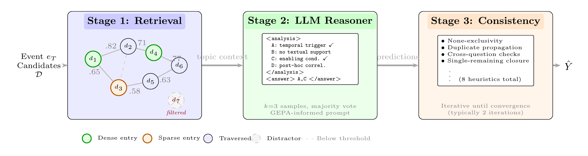
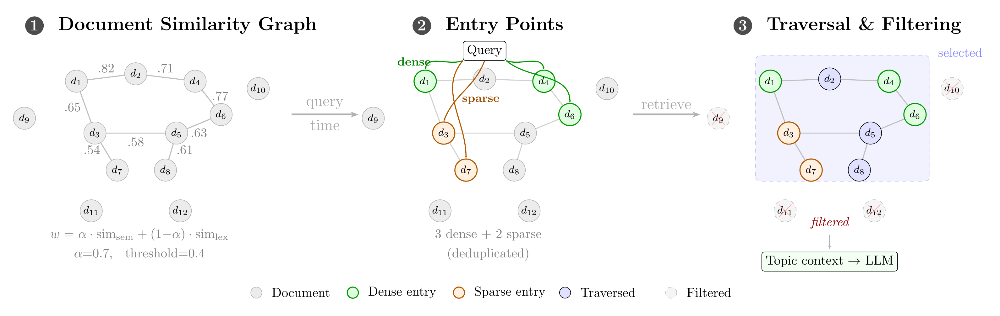
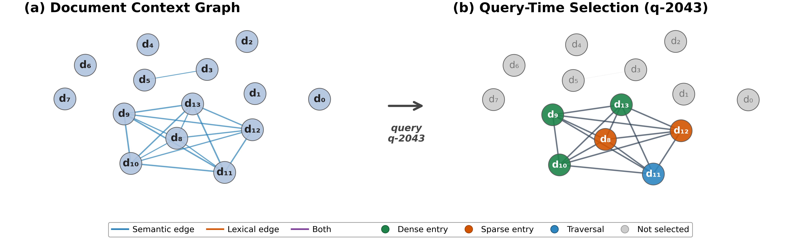

# AILS-NTUA at SemEval-2026 Task 12

**1st place on the evaluation leaderboard (0.95 accuracy)**

Graph-based retrieval and reflective prompting for abductive event reasoning.

> **Paper:** [AILS-NTUA at SemEval-2026 Task 12: Graph-Based Retrieval and Reflective Prompting for Abductive Event Reasoning](https://arxiv.org/abs/2506.06910) — *SemEval 2026*

Given a target event and context documents, the task is to identify which candidate explanations (A–D) are plausible causes — requiring abductive causal reasoning over real-world news events. We propose a three-stage system that combines hybrid graph-based retrieval, LLM-driven reasoning with prompt design informed by reflective prompt evolution (GEPA), and deterministic post-hoc consistency enforcement.

---

## Results

### Test Set (612 questions)

| Configuration | Base | + Post-hoc |
|:---|:---:|:---:|
| Claude Sonnet 4.5 Thinking | 0.904 | **0.952** |
| GPT-5.2 | 0.912 | 0.950 |
| Gemini 3 Flash Preview | 0.907 | 0.940 |
| SC: Sonnet 3× (θ=0.50) | 0.902 | 0.941 |
| SC: Gemini 5× (θ=0.50) | 0.902 | 0.927 |
| Ensemble (Sonnet + GPT + Gemini) | 0.935 | 0.946 |

Post-hoc = deterministic consistency enforcement (8 heuristics). SC = self-consistency with majority voting.

Full predictions, interactive dashboards, and submission files are available in [`experiments/test_results/`](experiments/test_results/).

---

## System Pipeline

<p align="center">
  
</p>

**Stage 1 — Retrieval:** Constructs a hybrid document similarity graph (semantic + lexical), selects dense/sparse entry points, retrieves the connected component via BFS, and filters disconnected distractors.

**Stage 2 — LLM Reasoner:** XML-structured analysis-before-answer prompting with self-consistency (k=3, majority vote). Prompt design informed by GEPA (reflective prompt evolution via DSPy).

**Stage 3 — Post-hoc Consistency:** Eight deterministic cross-question heuristics (none-exclusivity, duplicate propagation, cross-question checks, single-remaining closure) applied iteratively until convergence. This stage provides the single largest gain (+5.6 pp on dev).

---

## Graph-Based Retrieval

<p align="center">
  
</p>

For each topic, we build a hybrid similarity graph where edge weights combine dense embeddings (Cohere Embed v4) and sparse retrieval (BM25+ with entity boosting):

```
w(dᵢ, dⱼ) = α · sim_sem(dᵢ, dⱼ) + (1−α) · sim_lex(dᵢ, dⱼ),  α=0.7
```

At query time, entry points are selected from both signals (3 dense + 2 sparse, deduplicated), and the full connected component is retrieved. Disconnected documents are filtered as likely distractors. Topic-wide context aggregation across sibling questions yields a 91% cache hit rate and 87% cost reduction.

<p align="center">
  
</p>
<p align="center"><em>Topic 7 retrieval example with real data. Left: full 14-document hybrid graph. Right: query-time selection for q-2043 (6/14 documents retained).</em></p>

---

## Key Findings

- **Multi-answer gap:** All systems degrade 20–38 pp on multi-answer questions (47.5% of dev set). This is the primary bottleneck.
- **Three shared inductive biases** persist across all six model families:
  1. *Temporal proximity* — selecting the nearest temporal trigger over the actual cause
  2. *Specificity bias* — favoring concrete mechanisms over broader framings
  3. *Single-cause default* — preference for single answers despite multi-label requirements
- **Post-hoc heuristics** provide the largest single-stage gain (+5.6 pp), with 85.4% of corrections being genuine improvements.
- **Oracle upper bound** of 0.904 (best system per question) indicates 4.8 pp headroom from model complementarity.

---

## Quick Start

```bash
# Clone and setup
git clone https://github.com/nickarafyllis/semeval-2026-task12.git
cd semeval-2026-task12
python -m venv .venv && source .venv/bin/activate
pip install -r requirements.txt
python -m spacy download en_core_web_sm

# Configure API credentials (at least one provider)
cp .env.example .env  # Edit with your keys

# Run a quick test (10 questions)
python scripts/run_experiment.py \
  --model-family claude \
  --version claude-sonnet-4.5 \
  --limit 10 \
  --dataset sample

# View results
python scripts/list_experiments.py --sort score
```

---

## Architecture

```
                    ┌─────────────────────┐
                    │  run_experiment.py  │
                    │  optimize_prompts.py│
                    │  ensemble.py        │
                    └─────────┬───────────┘
                              │
                    ┌─────────▼───────────┐
                    │   BaseInference     │  Template Method Pattern
                    │  (src/inference/    │  Common: retry, caching,
                    │   base.py)          │  rate limiting, progress
                    └─────────┬───────────┘
          ┌───────┬───────┬───┴───┬───────┬───────┐
          ▼       ▼       ▼       ▼       ▼       ▼
       Claude  Gemini  OpenAI DeepSeek  Llama   Kimi
      (Bedrock) (API)  (API) (Bedrock)(Bedrock)(Bedrock)
```

Each model implementation inherits from `BaseInference` and overrides only three methods: `format_prompt()`, `call_model()`, and `parse_response()`. All common logic — retries with exponential backoff, adaptive per-thread rate limiting (token bucket), topic-wide prompt caching, progress tracking, and result aggregation — is handled by the base class.

---

## Supported Models

| Provider | Models | API |
|:---------|:-------|:----|
| Claude | Sonnet 4.0/4.5, Opus 4.0/4.5, Haiku 3.5/4.5 | AWS Bedrock |
| Gemini | Flash 3 Preview, Pro 3 Preview | Google API |
| OpenAI | GPT-4o, GPT-5, GPT-5.2, o1, o3, o3-mini | OpenAI API |
| DeepSeek | R1, V3.1 | AWS Bedrock |
| Llama | 3.3-70B | AWS Bedrock |
| Kimi | K2 Thinking | AWS Bedrock |

---

## Project Structure

```
├── src/
│   ├── inference/          # Model implementations (Template Method)
│   │   ├── base.py         # BaseInference: retry, caching, rate limiting
│   │   ├── claude.py       # Claude via AWS Bedrock
│   │   ├── gemini.py       # Gemini via Google API
│   │   ├── openai.py       # GPT/o-series via OpenAI
│   │   ├── deepseek.py     # DeepSeek R1/V3.1
│   │   ├── llama.py        # Llama 3.3-70B
│   │   └── kimi.py         # Kimi K2
│   ├── models/             # LLM client wrappers, DSPy integrations
│   ├── retrieval/          # Hybrid graph RAG (semantic + lexical)
│   ├── evaluation/         # Scoring, metrics, analysis
│   ├── experiments/        # Experiment management, dashboards
│   ├── prompts/            # Prompt template library
│   ├── data/               # Dataset loaders
│   └── utils/              # Cost tracking, submission formatting
│
├── scripts/
│   ├── run_experiment.py           # Main experiment runner
│   ├── optimize_prompts.py         # GEPA prompt optimization
│   ├── ensemble.py                 # Multi-model ensemble
│   ├── build_document_graph.py     # Graph RAG index construction
│   ├── preprocess_topic_wide_contexts.py
│   ├── list_experiments.py         # View/filter results
│   └── create_dashboard.py         # Interactive HTML dashboards
│
├── experiments/test_results/   # Predictions, dashboards, submissions
├── data/                       # SemEval dataset + sample data
├── configs/                    # API client configuration
└── figures/                    # Paper figures
```

---

## Citation

```bibtex
@misc{karafyllis2026ailsntuasemeval2026task12,
      title={AILS-NTUA at SemEval-2026 Task 12: Graph-Based Retrieval and Reflective Prompting for Abductive Event Reasoning}, 
      author={Nikolas Karafyllis and Maria Lymperaiou and Giorgos Filandrianos and Athanasios Voulodimos and Giorgos Stamou},
      year={2026},
      eprint={2603.04319},
      archivePrefix={arXiv},
      primaryClass={cs.CL},
      url={https://arxiv.org/abs/2603.04319}, 
}
```

## License

MIT — Copyright (c) 2025 Nikolas Karafyllis
